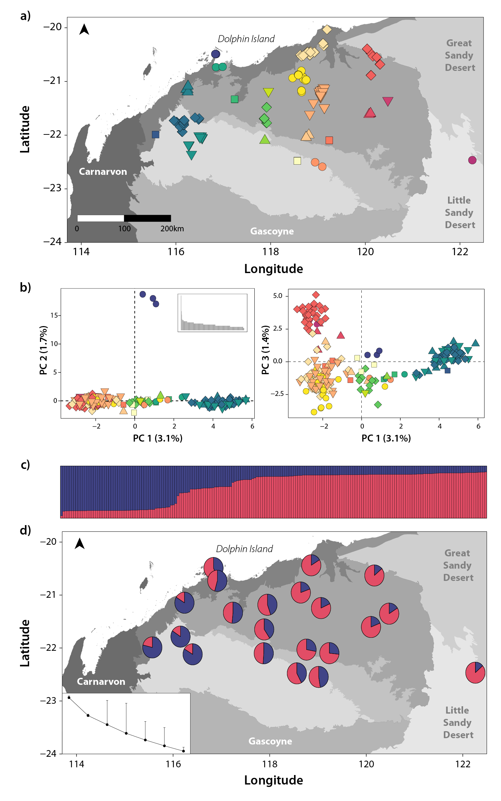

  

<b><i>Isolation-By-Distance: Genetic clustering analysis and population genetic summary statistics for D. hallucatus</i></b>

     

# Step 5: Clustering Analyses 

The R code *Step5_ClusteringAnalyses.R* documents the process of:
* Running a PCoA
* Plotting/visualising the PCoA results spatially with a sample map.
* Running various clustering analyses, including Tess3R, snmf (in LEA), and DAPC (discriminant analysis of principal components).
* Creating STRUCTURE-style barcharts, pie charts with admixture proportions and cross entropy plots.

### Input files:
* *D. hallucatus* genlight object (*Cleaned.Unrelated.gl.Dh.rdata*) after SNP filtering and sample cleaning and associated metadata (*Cleaned.Unrelated.Ind.metadata.Dh.csv*), imported from the *SNP_Filtering/SampleClean_outputs* folder.
* Shape files of the study region (*PilbaraIBRA.shp*) and of Western Australia (*IBRA_regions_WA.shp*) in the *Rasters_Shapefiles* folder in the home directory.

### Output files:
This code generates the following files (output to the *IBB_outputs* folder):
* *Cleaned.Unrelated.RmDup.gl.Dh_ClustInfo.rdata* - Genlight (with filtered SNPs, related pairs removed, and samples thinned so that there are no duplicated locations) saved as an R object
* *CrossVal.DAPC.Dh.pdf* - Figure: DAPC cross validation (for choosing optimal number of PCs to retain)
* *CrossVal.LEA.Dh.pdf* - Figure: LEA Cross entropy plot (for choosing best value for K)
* *CrossVal.Tess.Dh.pdf* - Figure: Tess3R Cross entropy plot (for choosing best value for K)
* *DAPC.BIC_Dh.pdf* - Figure: DAPC BIC plot (for choosing best value for K)
* *dapcPieBar_K2.Dh.pdf* - Figure: DAPC Structure-like barchart and ancestry proportions displayed as pie charts on a map of the study region
* *DF1.DAPC.Dh.pdf* - Figure: DAPC discriminant functions
* *Dh_Map.PCoA.pdf* - Figure: PCoA plot and map of study region with samples coloured to match PCoA groupings
* *Dh.geno* - Genotype file for input to LEA/snmf
* *Dh.snmf* - Folder containing data from LEA/snmf run
* *Dh.snmfProject* - Summary of snmf run
* *LEAPieBar_K2.Dh.pdf* - Figure: LEA Structure-like barchart and ancestry proportions displayed as pie charts on a map of the study region
* *snmf.obj.FullDat.best100reps.K1_7.Dh.R* - LEA/snmf full analysis saved as an R object
* *Tess.obj.FullDat.best100reps.K1_7.Dh.R* - Tess3R full analysis saved as an R object
* *TessPieBar_K2.Dh.pdf* - Figure: Tess3r Structure-like barchart and ancestry proportions displayed as pie charts on a map of the study region   

# Step 6: Export to Genalex and calculate individual heterozygosity

The R code *Step6_Genalex.GENHET.R* documents the process of:
* Testing for loci that do not conform to Hardy-Weinberg Expectations and removing them.
* Converting data to Genalex format and outputting this file for analysis in Excel
* Reading Genalex data for Mantel test back in and creating a publication-ready figure.
* Running the GENHET function to calculate individual heterozygosity, for all individuals and calculating the mean over a 15 km buffer zone.
* Identifying hot/cold spots, as determined by the standard deviation (1.5 or more standard deviations above/below the mean).

### Input files:
* The Genlight output during Step 5 (*IBB_outputs/Cleaned.Unrelated.RmDup.gl.Dh_ClustInfo.rdata*), where samples have been thinned to remove multiple individuals per location (i.e. duplicated coordinates).
* The original genlight object (*Cleaned.Unrelated.gl.Dh.rdata*) after SNP filtering and sample cleaning, with associated metadata (*Cleaned.Unrelated.Ind.metadata.Dh.csv*), imported from the *SNP_Filtering/SampleClean_outputs* folder.
* *Dh.HWE.Filt.genalex.xlsx* - Excel workbook containing full Genalex analysis (i.e. read back in after summary statistics and mantel test were performed outside of R).

### Output files:
This code generates the following files (output to the *IBB_outputs* folder):
* *Dh.HWE.Filt.genalex.csv* - csv with genlight genotypes output in Genalex format
* *IndHet.df.15km_mean.csv* - Results for individual heterozygosity, averaged over a 15km buffer zone
* *IndHet.df15km.csv* - Results for individual heterozygosity
* *Mantel.Pop.Plots.pdf* - Figure: Mantel test for each genetic cluster as a "population"

&nbsp;

&nbsp;

 This work is licensed under a <a rel="license" href="http://creativecommons.org/licenses/by/4.0/">Creative Commons Attribution 4.0 International License</a>.

