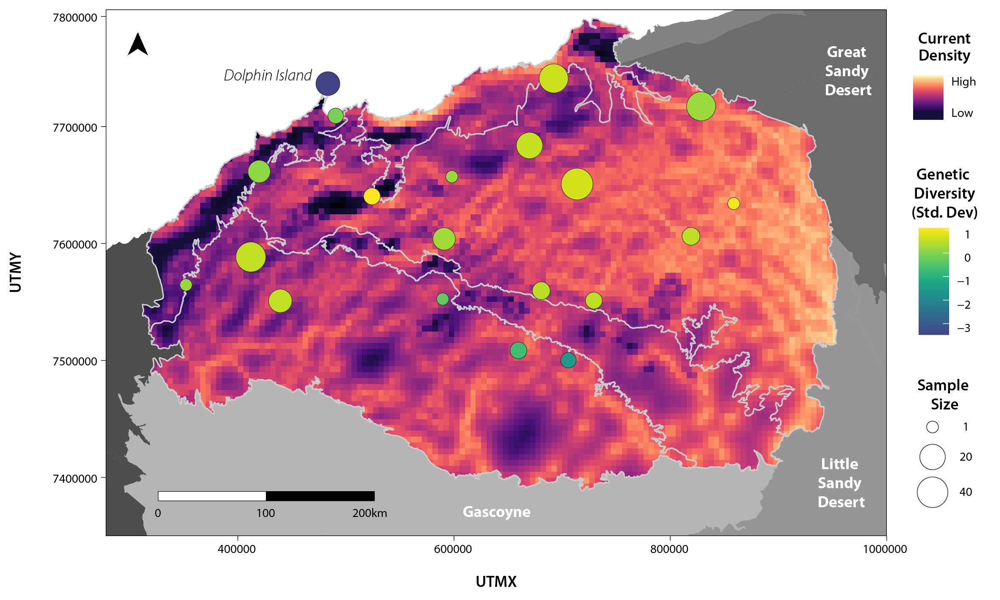

  

<b><i>Isolation-By-Resistance: MLPE model selection/layer optimisation and Circuitscape for D. hallucatus</i></b>

     

# Step 7: Isolation-By-Resistance 

The R code *Step7_IBR.R* documents the process of:
* Calculating mean pairwise Euclidean genetic distance within a 5km area (to match the pixel size of the rasters used in this analysis)
* Running single surface optimisation in ResistanceGA to determine the best performing raster within correlated variable sets
* Running multi-surface optimisation in ResistanceGA across the final raster set, including optimising raster transformations across a maximum of four combined layers, outputting final MLPE model selection, and running bootstrap analysis
* Plotting final raster transformations
* Loading in the best performing resistance surface, creating "node" coordinates and running Circuitscape through R to generate a current map
* Creating the final combined plot for the paper, including the current map and the individual heterozygosity estimates calculated during step 6

### Input files:
* *D. hallucatus* genlight object (*Cleaned.Unrelated.gl.Dh.rdata*) after SNP filtering and sample cleaning and associated metadata (*Cleaned.Unrelated.Ind.metadata.Dh.csv*), imported from the *SNP_Filtering/SampleClean_outputs* folder.
* Rasters aggregrated to a 5 km pixel size in the *Rasters_5km* folder in the home directory. Note that the final set of uncorrelated rasters used in the multisurface optimisation are in a subfolder, entitled: *Rasters_5km/Final_IBR_Set*
* Coordinate (*IBR_outputs/Coords_Dh.csv*) and genetic metric (*IBR_outputs/GeneticMetrics_Dh.csv*) csv files generated in the first section of this R code (read back in when running ResistanceGA)
* Shape files of the study region (*IBRA7_Mainland.and.DolphinIslandOnly.shp*), with islands removed (with the exception of Dolphin Island) in the *Rasters_Shapefiles* folder in the home directory.
* Final, top-ranked resistance surface (generated during the process above: *IBR_outputs/all.combrep_1/EucDistWater_Total.Silt_Total/EucDistWater_Total.Silt_Total.asc*) for creating current map in Circuitscape

### Output files:
This code generates the following files (output to the *IBR_outputs* folder):
* *all.combrep_1* - Folder containing full results from the multi-surface optimisation ResistanceGA run, with one folder per layer combination (details below)
* *Coords_Dh.csv* - Coordinates for samples used in IBR analysis
* *Dist2WaterTrans.pdf* - Layer transformation for the first variable in the top-ranked model 
* *GeneticMetrics_Dh.csv* - Mean pairwise genetic distance (within 5km pixel area) in table format for use in ResistanceGA
* *ResGA.CS.CurrentMap_IndHet.pdf* - Figure: final Current map with individual heterozygosity
* *SiltTrans.pdf* - Layer transformation for the second variable in the top-ranked model 
* *SS_Optim* - Folder containing full results from the single-surface optimisation ResistanceGA run, with one folder per layer (details below)

The following outputs can be found within the *all.combrep_1* folder:
* *All_Combinations_Summary.csv* - MLPE model selection results for all raster combinations
* *Bootstrap_Results.csv* - Results aggregated/averaged over 1000 bootstrap iterations for all raster combinations
 
The following outputs can be found under each layer combination subfolder in the *all.combrep_1* folder:
* *[Specific layer name/s here]_commuteDistance_distMat.csv* - Pairwise distance matrix with commute distances (i.e. distance between points calculated using the optimised resistance surface)
* *[Specific layer name/s here]_DiagnosticPlots.tif* - Diagnostic plots for MLPE model
* *[Specific layer name/s here]_full.rds* - R data
* *[Specific layer name/s here].asc* - Optimised resistance surface
* *[Specific layer name/s here].rds* - R data
* *MLPE_coeff_Table.csv* - MLPE model summary based on optimised resistance surface
* *Multisurface_Optim_Summary.txt* - Parameters and details for optimisation
* *Percent_Contribution.csv* - Percent each layer contributes to the final optimised resistance surface

The following outputs can be found within the *SS_Optim* folder:
* *All_Results_Table_SS.csv* - MLPE model selection results across each raster

The following outputs can be found under each layer combination subfolder in the *SS_Optim* folder:
* *All_Results_Table.csv* - MLPE model results, as well as NULL and distance model rankings
* *[Specific layer name/s here]_commuteDistance_distMat.csv* - Pairwise distance matrix with commute distances (i.e. distance between points calculated using the optimised resistance surface)
* *[Specific layer name/s here]_full.rds* - R data
* *[Specific layer name/s here].asc* - Optimised resistance surface
* *[Specific layer name/s here].rds* - R data
* *ContinuousResults.csv* - MLPE model results with layer transformations
* *Distance_commuteDistance_distMat.csv* - Pairwise distance matrix calculated using Euclidean distance for comparison (i.e. IBD)
* *MLPE_coeff_Table.csv* - MLPE model summary based on optimised resistance surface
* *Plots/[Specific layer name/s here]_DiagnosticPlots.tif* - Diagnostic plots for MLPE model
* *Plots/[Specific transformation here]_Transformation_[Specific layer name/s here].tif* - Plot showing raster transformation following optimisation

&nbsp;

&nbsp;

 This work is licensed under a <a rel="license" href="http://creativecommons.org/licenses/by/4.0/">Creative Commons Attribution 4.0 International License</a>.

