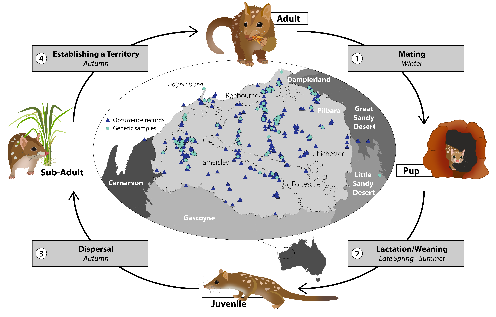
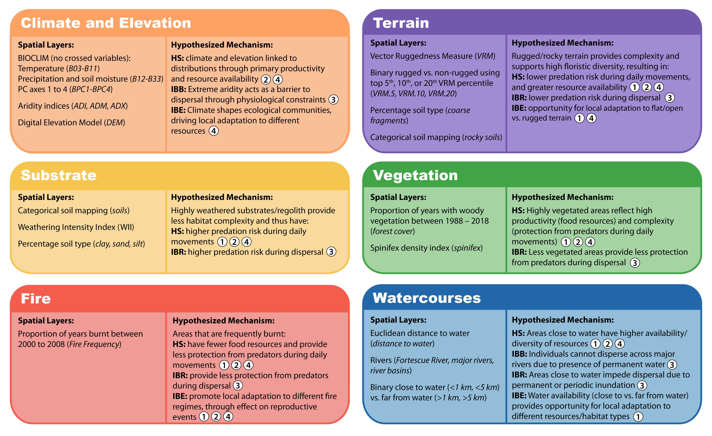

  

<b><i>Linking life history to landscape for threatened species conservation in a multi-use region</i></b>

     

### **Complete code for Conservation Biology paper (Article DOI: 10.1111/cobi.13989)

This repository contains R code, data and outputs for all analyses presented in the paper. The analyses are split into the following folders to reflect the main sections/subheadings in the paper (presented in order of analysis - note that outputs generated are sometimes used as inputs in the next step/s, so the order of analysis matters):
* **SDM:**
  - *Step1_RecordCleaning.R*
  - *Step2_RunMaxent.R*
* **SNP_Filtering:**
  - *Step3_DArTSNPFilt.R*
  - *Step4_SampleCleaning.R*
* **IBB:**
  - *Step5_ClusteringAnalyses.R*
  - *Step6_Genalex.GENHET.R*
* **IBR:**
  - *Step7_IBR.R*
* **IBE:**
  - *Step8_IBE.R*

There are README files in each of the analysis sub-folders listed above, which describe the analysis, the data (inputs) and the resulting output files. 

The remaining sub folders contain data used throughout the different analyses, as described below:
* **Figs:** This folder contains figures from the paper that are presented in the README files
* **Rasters_Shapefiles:** This folder contains rasters and shapefiles covering the Pilbara region of Western Australia. All rasters in this folder have been aggregated to a 1 km resolution. For details on spatial layers, see the Supplementary Information for this paper (Appendix S2), and the figure below.
* **Rasters_5km:** This folder contains a subset of the rasters described above, that have been further aggregated to a 5 km resolution (for Isolation-By-Resistance modelling). More detials are in the README file under **IBR**.

&nbsp;

<b><i>Spatial layers explored in this study:</i></b>

     

##### Raster layers with associated acronyms, the hypothesised mechanism driving spatial-environmental associations, and how these link to the life cycle/demography of the northern quoll (numbers match above figure).The specific hypotheses include HS= habitat suitability, tested using Species Distribution Modelling; IBB= isolation-by-barrier, environmental associations tested using Generalised Dissimilarity Modelling (GDM); IBR= isolation-by-resistance, tested using linear mixed effects models with MLPE; IBE= isolation-by-environment, tested using GDM.

&nbsp;

***

## **R Session Information for all analyses:**

### Session info
| setting  | value                                                                       |
|----------|-----------------------------------------------------------------------------|
| version  | R version 4.1.2 (2021-11-01)                                                |
| os       | macOS Monterey 12.5                                                         |
| system   | x86_64, darwin17.0                                                          |
| ui       | RStudio                                                                     |
| language | (EN)                                                                        |
| collate  | en_AU.UTF-8                                                                 |
| ctype    | en_AU.UTF-8                                                                 |
| tz       | Australia/Sydney                                                            |
| date     | 2022-08-17                                                                  |
| rstudio  | 2021.09.1+372 Ghost Orchid (desktop)                                        |
| pandoc   | 2.14.0.3 @ /Applications/RStudio.app/Contents/MacOS/pandoc/ (via rmarkdown) |

### Packages info
| package         | * version      | date (UTC) | lib | source                                   |
|-----------------|----------------|------------|-----|------------------------------------------|
| abind           | 1.4-5          | 2016-07-21 | [1] | CRAN (R 4.1.0)                           |
| ade4            | * 1.7-18       | 2021-09-16 | [1] | CRAN (R 4.1.0)                           |
| adegenet        | * 2.1.5        | 2021-10-09 | [1] | CRAN (R 4.1.0)                           |
| akima           | 0.6-3.4        | 2022-04-27 | [1] | CRAN (R 4.1.2)                           |
| ape             | 5.6-2          | 2022-03-02 | [1] | CRAN (R 4.1.2)                           |
| assertthat      | 0.2.1          | 2019-03-21 | [1] | CRAN (R 4.1.0)                           |
| backports       | 1.4.1          | 2021-12-13 | [1] | CRAN (R 4.1.0)                           |
| base64enc       | 0.1-3          | 2015-07-28 | [1] | CRAN (R 4.1.0)                           |
| BiocGenerics    | * 0.40.0       | 2021-10-26 | [1] | Bioconductor                             |
| bitops          | 1.0-7          | 2021-04-24 | [1] | CRAN (R 4.1.0)                           |
| boot            | 1.3-28         | 2021-05-03 | [1] | CRAN (R 4.1.2)                           |
| broom           | 0.8.0          | 2022-04-13 | [1] | CRAN (R 4.1.2)                           |
| calibrate       | 1.7.7          | 2020-06-19 | [1] | CRAN (R 4.1.0)                           |
| car             | 3.0-13         | 2022-05-02 | [1] | CRAN (R 4.1.2)                           |
| carData         | 3.0-5          | 2022-01-06 | [1] | CRAN (R 4.1.2)                           |
| caret           | 6.0-91         | 2022-03-11 | [1] | CRAN (R 4.1.2)                           |
| cellranger      | 1.1.0          | 2016-07-27 | [1] | CRAN (R 4.1.0)                           |
| class           | 7.3-20         | 2022-01-13 | [1] | CRAN (R 4.1.2)                           |
| classInt        | 0.4-7          | 2022-06-10 | [1] | CRAN (R 4.1.2)                           |
| cli             | 3.3.0          | 2022-04-25 | [1] | CRAN (R 4.1.2)                           |
| clipr           | 0.8.0          | 2022-02-22 | [1] | CRAN (R 4.1.2)                           |
| cluster         | 2.1.2          | 2021-04-17 | [1] | CRAN (R 4.1.2)                           |
| codetools       | 0.2-18         | 2020-11-04 | [1] | CRAN (R 4.1.2)                           |
| colorblindr     | * 0.1.0        | 2022-02-14 | [1] | Github (clauswilke/colorblindr@e6730be)  |
| colorspace      | * 2.0-3        | 2022-01-15 | [1] | R-Forge (R 4.1.2)                        |
| combinat        | 0.0-8          | 2012-10-29 | [1] | CRAN (R 4.1.0)                           |
| corrplot        | * 0.92         | 2021-11-18 | [1] | CRAN (R 4.1.2)                           |
| cowplot         | * 1.1.1        | 2022-02-14 | [1] | Github (wilkelab/cowplot@555c9ae)        |
| crayon          | 1.5.1          | 2022-03-26 | [1] | CRAN (R 4.1.2)                           |
| dartR           | * 2.0.3        | 2022-03-28 | [1] | CRAN (R 4.1.2)                           |
| data.table      | 1.14.2         | 2021-09-27 | [1] | CRAN (R 4.1.0)                           |
| DBI             | 1.1.2          | 2021-12-20 | [1] | CRAN (R 4.1.0)                           |
| dbplyr          | 2.1.1          | 2021-04-06 | [1] | CRAN (R 4.1.0)                           |
| deldir          | 1.0-6          | 2021-10-23 | [1] | CRAN (R 4.1.0)                           |
| desc            | 1.4.1          | 2022-03-06 | [1] | CRAN (R 4.1.2)                           |
| details         | * 0.3.0        | 2022-03-27 | [1] | CRAN (R 4.1.2)                           |
| dichromat       | 2.0-0.1        | 2022-05-02 | [1] | CRAN (R 4.1.2)                           |
| digest          | 0.6.29         | 2021-12-01 | [1] | CRAN (R 4.1.0)                           |
| dismo           | 1.3-5          | 2021-10-11 | [1] | CRAN (R 4.1.0)                           |
| doParallel      | * 1.0.17       | 2022-02-07 | [1] | CRAN (R 4.1.2)                           |
| dotCall64       | 1.0-1          | 2021-02-11 | [1] | CRAN (R 4.1.0)                           |
| dplyr           | * 1.0.9        | 2022-04-28 | [1] | CRAN (R 4.1.2)                           |
| e1071           | 1.7-11         | 2022-06-07 | [1] | CRAN (R 4.1.2)                           |
| ecodist         | * 2.0.7        | 2020-08-28 | [1] | CRAN (R 4.1.0)                           |
| ellipsis        | 0.3.2          | 2021-04-29 | [1] | CRAN (R 4.1.0)                           |
| ENMeval         | * 2.0.3        | 2022-01-10 | [1] | CRAN (R 4.1.2)                           |
| enmSdm          | * 0.9.3        | 2022-07-05 | [1] | Github (adamlilith/enmSdm@ebf131a)       |
| evaluate        | 0.15           | 2022-02-18 | [1] | CRAN (R 4.1.2)                           |
| exactextractr   | 0.7.2          | 2021-12-05 | [1] | CRAN (R 4.1.0)                           |
| fansi           | 1.0.3          | 2022-03-24 | [1] | CRAN (R 4.1.2)                           |
| farver          | 2.1.0          | 2021-02-28 | [1] | CRAN (R 4.1.0)                           |
| fastmap         | 1.1.0          | 2021-01-25 | [1] | CRAN (R 4.1.0)                           |
| fields          | 13.3           | 2021-10-30 | [1] | CRAN (R 4.1.0)                           |
| flextable       | * 0.7.2        | 2022-06-12 | [1] | CRAN (R 4.1.2)                           |
| forcats         | * 0.5.1        | 2021-01-27 | [1] | CRAN (R 4.1.0)                           |
| foreach         | * 1.5.2        | 2022-02-02 | [1] | CRAN (R 4.1.2)                           |
| foreign         | 0.8-82         | 2022-01-13 | [1] | CRAN (R 4.1.2)                           |
| fs              | 1.5.2          | 2021-12-08 | [1] | CRAN (R 4.1.0)                           |
| future          | 1.26.1         | 2022-05-27 | [1] | CRAN (R 4.1.2)                           |
| future.apply    | 1.8.1          | 2021-08-10 | [1] | CRAN (R 4.1.0)                           |
| GA              | 3.2.2          | 2021-10-15 | [1] | CRAN (R 4.1.0)                           |
| gap             | 1.2.3-1        | 2021-04-21 | [1] | CRAN (R 4.1.0)                           |
| gdata           | 2.18.0         | 2017-06-06 | [1] | CRAN (R 4.1.0)                           |
| gdistance       | 1.3-6          | 2020-06-29 | [1] | CRAN (R 4.1.0)                           |
| gdm             | * 1.5.0-1      | 2021-11-18 | [1] | CRAN (R 4.1.0)                           |
| gdsfmt          | * 1.30.0       | 2021-10-26 | [1] | Bioconductor                             |
| gdtools         | 0.2.4          | 2022-02-14 | [1] | CRAN (R 4.1.2)                           |
| generics        | 0.1.2          | 2022-01-31 | [1] | CRAN (R 4.1.2)                           |
| genetics        | 1.3.8.1.3      | 2021-03-01 | [1] | CRAN (R 4.1.0)                           |
| GGally          | * 2.1.2        | 2021-06-21 | [1] | CRAN (R 4.1.0)                           |
| ggExtra         | 0.10.0         | 2022-03-23 | [1] | CRAN (R 4.1.2)                           |
| ggforce         | 0.3.3          | 2021-03-05 | [1] | CRAN (R 4.1.0)                           |
| ggfun           | 0.0.5          | 2022-01-20 | [1] | CRAN (R 4.1.2)                           |
| ggmap           | 3.0.0          | 2019-02-05 | [1] | CRAN (R 4.1.0)                           |
| ggnewscale      | * 0.4.7        | 2022-03-25 | [1] | CRAN (R 4.1.2)                           |
| ggplot2         | * 3.3.6        | 2022-05-03 | [1] | CRAN (R 4.1.2)                           |
| ggpubr          | * 0.4.0        | 2020-06-27 | [1] | CRAN (R 4.1.0)                           |
| ggsignif        | 0.6.3          | 2021-09-09 | [1] | CRAN (R 4.1.0)                           |
| ggsn            | * 0.5.0        | 2019-02-18 | [1] | CRAN (R 4.1.0)                           |
| globals         | 0.15.0         | 2022-05-09 | [1] | CRAN (R 4.1.2)                           |
| glue            | 1.6.2          | 2022-02-24 | [1] | CRAN (R 4.1.2)                           |
| goftest         | 1.2-3          | 2021-10-07 | [1] | CRAN (R 4.1.0)                           |
| gower           | 1.0.0          | 2022-02-03 | [1] | CRAN (R 4.1.2)                           |
| graph           | * 1.72.0       | 2021-10-26 | [1] | Bioconductor                             |
| gridExtra       | * 2.3          | 2017-09-09 | [1] | CRAN (R 4.1.0)                           |
| gtable          | 0.3.0          | 2019-03-25 | [1] | CRAN (R 4.1.0)                           |
| gtools          | * 3.9.2        | 2021-06-06 | [1] | CRAN (R 4.1.0)                           |
| hardhat         | 1.1.0          | 2022-06-10 | [1] | CRAN (R 4.1.2)                           |
| haven           | 2.5.0          | 2022-04-15 | [1] | CRAN (R 4.1.2)                           |
| hms             | 1.1.1          | 2021-09-26 | [1] | CRAN (R 4.1.0)                           |
| htmltools       | 0.5.2          | 2021-08-25 | [1] | CRAN (R 4.1.0)                           |
| httpuv          | 1.6.5          | 2022-01-05 | [1] | CRAN (R 4.1.2)                           |
| httr            | 1.4.3          | 2022-05-04 | [1] | CRAN (R 4.1.2)                           |
| igraph          | 1.3.2          | 2022-06-13 | [1] | CRAN (R 4.1.2)                           |
| ipred           | 0.9-12         | 2021-09-15 | [1] | CRAN (R 4.1.0)                           |
| iterators       | * 1.0.14       | 2022-02-05 | [1] | CRAN (R 4.1.2)                           |
| jpeg            | 0.1-9          | 2021-07-24 | [1] | CRAN (R 4.1.0)                           |
| jsonlite        | 1.8.0          | 2022-02-22 | [1] | CRAN (R 4.1.2)                           |
| JuliaCall       | 0.17.4         | 2021-05-16 | [1] | CRAN (R 4.1.0)                           |
| KernSmooth      | 2.23-20        | 2021-05-03 | [1] | CRAN (R 4.1.2)                           |
| knitr           | 1.39.6         | 2022-08-02 | [1] | Github (yihui/knitr@bebf67e)             |
| later           | 1.3.0          | 2021-08-18 | [1] | CRAN (R 4.1.0)                           |
| lattice         | * 0.20-45      | 2021-09-22 | [1] | CRAN (R 4.1.2)                           |
| lava            | 1.6.10         | 2021-09-02 | [1] | CRAN (R 4.1.0)                           |
| LEA             | * 3.6.0        | 2021-10-26 | [1] | Bioconductor                             |
| legendary       | * 0.0.1.10     | 2022-02-21 | [1] | Github (adamlilith/legendary@f6b316c)    |
| lifecycle       | 1.0.1          | 2021-09-24 | [1] | CRAN (R 4.1.0)                           |
| listenv         | 0.8.0          | 2019-12-05 | [1] | CRAN (R 4.1.0)                           |
| lme4            | 1.1-29         | 2022-04-07 | [1] | CRAN (R 4.1.2)                           |
| lubridate       | 1.8.0          | 2021-10-07 | [1] | CRAN (R 4.1.0)                           |
| magrittr        | * 2.0.3        | 2022-03-30 | [1] | CRAN (R 4.1.2)                           |
| mapproj         | 1.2.8          | 2022-01-12 | [1] | CRAN (R 4.1.2)                           |
| maps            | 3.4.0          | 2021-09-25 | [1] | CRAN (R 4.1.0)                           |
| maptools        | 1.1-4          | 2022-04-17 | [1] | CRAN (R 4.1.2)                           |
| MASS            | * 7.3-55       | 2022-01-13 | [1] | CRAN (R 4.1.2)                           |
| Matrix          | 1.4-0          | 2021-12-08 | [1] | CRAN (R 4.1.0)                           |
| mgcv            | 1.8-39         | 2022-02-24 | [1] | CRAN (R 4.1.2)                           |
| mime            | 0.12           | 2021-09-28 | [1] | CRAN (R 4.1.0)                           |
| miniUI          | 0.1.1.1        | 2018-05-18 | [1] | CRAN (R 4.1.0)                           |
| minqa           | 1.2.4          | 2014-10-09 | [1] | CRAN (R 4.1.0)                           |
| mmod            | 1.3.3          | 2017-04-06 | [1] | CRAN (R 4.1.0)                           |
| ModelMetrics    | 1.2.2.2        | 2020-03-17 | [1] | CRAN (R 4.1.0)                           |
| modelr          | 0.1.8          | 2020-05-19 | [1] | CRAN (R 4.1.0)                           |
| MuMIn           | 1.46.0         | 2022-02-24 | [1] | CRAN (R 4.1.2)                           |
| munsell         | 0.5.0          | 2018-06-12 | [1] | CRAN (R 4.1.0)                           |
| mvtnorm         | 1.1-3          | 2021-10-08 | [1] | CRAN (R 4.1.0)                           |
| nlme            | 3.1-155        | 2022-01-13 | [1] | CRAN (R 4.1.2)                           |
| nloptr          | 2.0.3          | 2022-05-26 | [1] | CRAN (R 4.1.2)                           |
| nnet            | 7.3-17         | 2022-01-13 | [1] | CRAN (R 4.1.2)                           |
| officer         | * 0.4.3        | 2022-06-12 | [1] | CRAN (R 4.1.2)                           |
| pals            | * 1.7          | 2021-04-17 | [1] | CRAN (R 4.1.0)                           |
| parallelly      | 1.30.0         | 2021-12-17 | [1] | CRAN (R 4.1.0)                           |
| patchwork       | 1.1.1          | 2020-12-17 | [1] | CRAN (R 4.1.0)                           |
| pegas           | 1.1            | 2021-12-16 | [1] | CRAN (R 4.1.0)                           |
| permute         | 0.9-7          | 2022-01-27 | [1] | CRAN (R 4.1.2)                           |
| pillar          | 1.7.0          | 2022-02-01 | [1] | CRAN (R 4.1.2)                           |
| pkgconfig       | 2.0.3          | 2019-09-22 | [1] | CRAN (R 4.1.0)                           |
| plyr            | 1.8.7          | 2022-03-24 | [1] | CRAN (R 4.1.2)                           |
| png             | 0.1-7          | 2013-12-03 | [1] | CRAN (R 4.1.0)                           |
| pointdexter     | * 0.1.1        | 2022-08-15 | [1] | Github (cenuno/pointdexter@1d777d8)      |
| polyclip        | 1.10-0         | 2019-03-14 | [1] | CRAN (R 4.1.0)                           |
| PopGenReport    | 3.0.4          | 2019-02-04 | [1] | CRAN (R 4.1.0)                           |
| pROC            | 1.18.0         | 2021-09-03 | [1] | CRAN (R 4.1.0)                           |
| prodlim         | 2019.11.13     | 2019-11-17 | [1] | CRAN (R 4.1.0)                           |
| promises        | 1.2.0.1        | 2021-02-11 | [1] | CRAN (R 4.1.0)                           |
| proxy           | 0.4-27         | 2022-06-09 | [1] | CRAN (R 4.1.2)                           |
| purrr           | * 0.3.4        | 2020-04-17 | [1] | CRAN (R 4.1.0)                           |
| R.methodsS3     | 1.8.1          | 2020-08-26 | [1] | CRAN (R 4.1.0)                           |
| R.oo            | 1.24.0         | 2020-08-26 | [1] | CRAN (R 4.1.0)                           |
| R.utils         | 2.11.0         | 2021-09-26 | [1] | CRAN (R 4.1.0)                           |
| R6              | 2.5.1          | 2021-08-19 | [1] | CRAN (R 4.1.0)                           |
| raster          | * 3.5-15       | 2022-01-22 | [1] | CRAN (R 4.1.2)                           |
| RBGL            | * 1.70.0       | 2021-10-26 | [1] | Bioconductor                             |
| RColorBrewer    | * 1.1-3        | 2022-04-03 | [1] | CRAN (R 4.1.2)                           |
| Rcpp            | 1.0.8.3        | 2022-03-17 | [1] | CRAN (R 4.1.2)                           |
| RcppEigen       | 0.3.3.9.2      | 2022-04-08 | [1] | CRAN (R 4.1.2)                           |
| readr           | * 2.1.2        | 2022-01-30 | [1] | CRAN (R 4.1.2)                           |
| readxl          | * 1.3.1        | 2019-03-13 | [1] | CRAN (R 4.1.0)                           |
| recipes         | 0.2.0          | 2022-02-18 | [1] | CRAN (R 4.1.2)                           |
| related         | * 0.8          | 2014-04-16 | [1] | R-Forge (R 4.1.2)                        |
| reprex          | 2.0.1          | 2021-08-05 | [1] | CRAN (R 4.1.0)                           |
| reshape         | * 0.8.8        | 2018-10-23 | [1] | CRAN (R 4.1.0)                           |
| reshape2        | * 1.4.4        | 2020-04-09 | [1] | CRAN (R 4.1.0)                           |
| ResistanceGA    | * 4.2-3        | 2022-06-16 | [1] | Github (wpeterman/ResistanceGA@e1d309f)  |
| rgdal           | * 1.5-28       | 2021-12-15 | [1] | CRAN (R 4.1.0)                           |
| RgoogleMaps     | 1.4.5.3        | 2020-02-12 | [1] | CRAN (R 4.1.0)                           |
| rjson           | 0.2.21         | 2022-01-09 | [1] | CRAN (R 4.1.2)                           |
| rlang           | 1.0.2          | 2022-03-04 | [1] | CRAN (R 4.1.2)                           |
| rmarkdown       | 2.14           | 2022-04-25 | [1] | CRAN (R 4.1.2)                           |
| rpart           | 4.1.16         | 2022-01-24 | [1] | CRAN (R 4.1.2)                           |
| rprojroot       | 2.0.3          | 2022-04-02 | [1] | CRAN (R 4.1.2)                           |
| rstatix         | 0.7.0          | 2021-02-13 | [1] | CRAN (R 4.1.0)                           |
| RStoolbox       | * 0.3.0        | 2022-03-07 | [1] | CRAN (R 4.1.2)                           |
| rstudioapi      | 0.13           | 2020-11-12 | [1] | CRAN (R 4.1.0)                           |
| rvest           | 1.0.2          | 2021-10-16 | [1] | CRAN (R 4.1.0)                           |
| s2              | 1.0.7          | 2021-09-28 | [1] | CRAN (R 4.1.0)                           |
| scales          | 1.2.0          | 2022-04-13 | [1] | CRAN (R 4.1.2)                           |
| scatterpie      | * 0.1.7        | 2021-08-20 | [1] | CRAN (R 4.1.0)                           |
| SDMtune         | * 1.1.5        | 2021-07-17 | [1] | CRAN (R 4.1.0)                           |
| seqinr          | 4.2-8          | 2021-06-09 | [1] | CRAN (R 4.1.0)                           |
| sessioninfo     | * 1.2.2        | 2021-12-06 | [1] | CRAN (R 4.1.0)                           |
| sf              | * 1.0-7        | 2022-03-07 | [1] | CRAN (R 4.1.2)                           |
| shiny           | 1.7.1          | 2021-10-02 | [1] | CRAN (R 4.1.0)                           |
| SNPRelate       | * 1.28.0       | 2021-10-26 | [1] | Bioconductor                             |
| sp              | * 1.5-0        | 2022-06-05 | [1] | CRAN (R 4.1.2)                           |
| spam            | 2.8-0          | 2022-01-06 | [1] | CRAN (R 4.1.2)                           |
| spatstat.core   | 2.4-4          | 2022-05-18 | [1] | CRAN (R 4.1.2)                           |
| spatstat.data   | 2.2-0          | 2022-04-18 | [1] | CRAN (R 4.1.2)                           |
| spatstat.geom   | 2.4-0          | 2022-03-29 | [1] | CRAN (R 4.1.2)                           |
| spatstat.random | 2.2-0          | 2022-03-30 | [1] | CRAN (R 4.1.2)                           |
| spatstat.sparse | 2.1-1          | 2022-04-18 | [1] | CRAN (R 4.1.2)                           |
| spatstat.utils  | 2.3-1          | 2022-05-06 | [1] | CRAN (R 4.1.2)                           |
| spData          | 2.0.1          | 2021-10-14 | [1] | CRAN (R 4.1.0)                           |
| spdep           | 1.2-4          | 2022-04-18 | [1] | CRAN (R 4.1.2)                           |
| splancs         | 2.01-43        | 2022-04-17 | [1] | CRAN (R 4.1.2)                           |
| splitstackshape | * 1.4.8        | 2019-04-21 | [1] | CRAN (R 4.1.0)                           |
| StAMPP          | 1.6.3          | 2021-08-08 | [1] | CRAN (R 4.1.0)                           |
| stringi         | 1.7.8          | 2022-07-11 | [1] | CRAN (R 4.1.2)                           |
| stringr         | * 1.4.0        | 2019-02-10 | [1] | CRAN (R 4.1.0)                           |
| survival        | 3.3-1          | 2022-03-03 | [1] | CRAN (R 4.1.2)                           |
| systemfonts     | 1.0.4          | 2022-02-11 | [1] | CRAN (R 4.1.2)                           |
| tensor          | 1.5            | 2012-05-05 | [1] | CRAN (R 4.1.0)                           |
| terra           | 1.5-21         | 2022-02-17 | [1] | CRAN (R 4.1.2)                           |
| tess3r          | * 1.1.0        | 2021-12-01 | [1] | Github (bcm-uga/TESS3_encho_sen@48314bc) |
| tibble          | * 3.1.7        | 2022-05-03 | [1] | CRAN (R 4.1.2)                           |
| tidyr           | * 1.2.0        | 2022-02-01 | [1] | CRAN (R 4.1.2)                           |
| tidyselect      | 1.1.2          | 2022-02-21 | [1] | CRAN (R 4.1.2)                           |
| tidyverse       | * 1.3.1        | 2021-04-15 | [1] | CRAN (R 4.1.0)                           |
| timeDate        | 3043.102       | 2018-02-21 | [1] | CRAN (R 4.1.0)                           |
| tweenr          | 1.0.2          | 2021-03-23 | [1] | CRAN (R 4.1.0)                           |
| tzdb            | 0.3.0          | 2022-03-28 | [1] | CRAN (R 4.1.2)                           |
| units           | 0.8-0          | 2022-02-05 | [1] | CRAN (R 4.1.2)                           |
| usdm            | * 1.1-18       | 2017-06-25 | [1] | CRAN (R 4.1.0)                           |
| utf8            | 1.2.2          | 2021-07-24 | [1] | CRAN (R 4.1.0)                           |
| uuid            | 1.1-0          | 2022-04-19 | [1] | CRAN (R 4.1.2)                           |
| vctrs           | 0.4.1          | 2022-04-13 | [1] | CRAN (R 4.1.2)                           |
| vegan           | 2.5-7          | 2020-11-28 | [1] | CRAN (R 4.1.0)                           |
| Vennerable      | * 3.0          | 2013-07-24 | [1] | R-Forge (R 4.1.2)                        |
| viridis         | * 0.6.2        | 2021-10-13 | [1] | CRAN (R 4.1.0)                           |
| viridisLite     | * 0.4.0        | 2021-04-13 | [1] | CRAN (R 4.1.0)                           |
| wesanderson     | * 0.3.6        | 2018-04-20 | [1] | CRAN (R 4.1.0)                           |
| withr           | 2.5.0          | 2022-03-03 | [1] | CRAN (R 4.1.2)                           |
| wk              | 0.6.0          | 2022-01-03 | [1] | CRAN (R 4.1.2)                           |
| xfun            | 0.31           | 2022-05-10 | [1] | CRAN (R 4.1.2)                           |
| XML             | 3.99-0.9       | 2022-02-24 | [1] | CRAN (R 4.1.2)                           |
| xml2            | 1.3.3          | 2021-11-30 | [1] | CRAN (R 4.1.0)                           |
| XR              | 0.7.2          | 2018-03-18 | [1] | CRAN (R 4.1.0)                           |
| XRJulia         | 0.9.0          | 2019-05-05 | [1] | CRAN (R 4.1.0)                           |
| xtable          | * 1.8-4        | 2019-04-21 | [1] | CRAN (R 4.1.0)                           |
| zeallot         | * 0.1.0        | 2018-01-28 | [1] | CRAN (R 4.1.0)                           |
| zip             | 2.2.0          | 2021-05-31 | [1] | CRAN (R 4.1.0)                           |

[1] /Library/Frameworks/R.framework/Versions/4.1/Resources/library

***

&nbsp;

&nbsp;

 This work is licensed under a <a rel="license" href="http://creativecommons.org/licenses/by/4.0/">Creative Commons Attribution 4.0 International License</a>.

