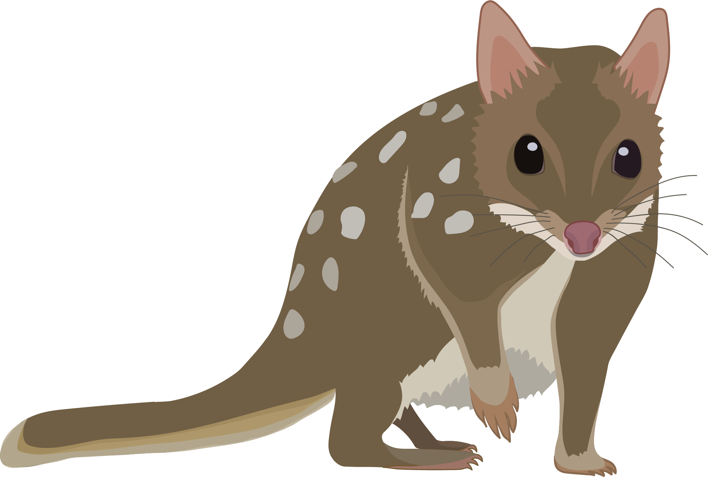

<b><i>SNP filtering and sample cleaning for D. hallucatus</i></b>

     

# Step 3: SNP Filtering

The code *Step3_DArTSNPFilt.R* documents the filtering pipeline for this study. We also provide a detailed tutorial (*Step3_DArTSNPFilt.pdf*) for DArTSeq (https://www.diversityarrays.com/) SNP visualisation and filtering, although this is also relevant to any reduced representation SNP data. 

### Input files:  
* Supplied by DArT: 1-row SNP csv - *Data/Report_DDasy19-4717_1Row_NameEdit.csv*
* Supplied by DArT: 2-row SNP csv - *Data/Report_DDasy19-4717_2Row_NameEdit.csv*  
* Supplied by DArT: Read count csv - *Data/ReadCounts_DDasy19-4717_NameEdit.csv*  
* Sample meta-data csv (including ID, pop, lon/lat, other info) - *Data/Dasyurus_hallucatus_ind.metadata.csv*
* Tasmanian devil chromosome info - *Data/TasDevil7.1_Scaffold_Info.csv*  
* Shape file of study region in *Rasters_Shapefiles* folder in the home directory - *PilbaraIBRA.shp* 

### Output files:  
Individual plots and the filtered data are saved in the *Filtering_outputs* folder (note that all plots are explained/interpreted in the tutorial):
- *Dhal.FiltSumStats.csv* - Summary statistics for each SNP locus after filtering
- *Dhal.Ind.Pop.jpg* - Combined smear plot, individual call rate, and population sample sizes
- *Dhal.RawHistograms.Mapped-UnMapped.jpg* - Histograms of important metrics across SNPs mapped to the Tasmanian devil genome vs. unmapped SNPs
- *Dhal.RawSumStats.csv* - Summary statistics for each SNP locus before filtering
- *DhalChrom.jpg* - SNP positions in the Tasmanian devil genome
- *DhalCorr.FinalFilt.jpg* - Correlations between important metrics in the final filtered data set
- *DhalCorr.QualFilt.jpg* - Correlations between important metrics in the data set after quality control filters
- *DhalCorr.Raw.jpg* - Correlations between important metrics in the raw data set
- *DhalFinal.PCoA.jpg* - PCoA of the final filtered dataset
- *DhalInd.ReadCount.jpg* - Combined plot showing how individual read counts effect the called genotype, allele balance and important population level metrics
- *DhalPriv.Al.jpg* - Private alleles in each population before and after MAF filter
- *DhalRaw.PCoA_Map.jpg* - PCoA of raw data set
- *DhalSampleMap.IndCR.jpg* - Map showing sample locations coloured by individual call rate
- *DhalSummStat.FinalFilt.jpg* - Histograms and scatter plots for important summary statistics on the final filtered data set
- *DhalSummStat.QualFilt.jpg* - Histograms and scatter plots for important summary statistics after quality control filtering
- *DhalSummStat.Raw.jpg* - Histograms and scatter plots for important summary statistics before filtering
- *gl.Dhal_FinalFilt.rdata* - Genlight for the final filtered SNP data set, saved as an R object
- *Mapped_gl.CR.RC.Rp.MAF.lD.gds* - gds file for use in SNPRelate (LD pruning - mapped loci)
- *UnMapped_gl.CR.RC.Rp.MAF.lD.gds* - gds file for use in SNPRelate (LD pruning - unmapped loci)

See R code for more details.

# Step 4: Sample Cleaning

Following SNP filtering, we carried out sample cleaning using the R code *Step4_SampleCleaning.R*, by removing duplicated samples (i.e. samples accidentally sequenced twice due to a labeling issue), and highly related individuals. We calculate Wang's (2002) pairwise relatedness estimate and remove one individual from the pair if relatedness is greater >=0.25 to avoid biasing population genetic analyses. Finally, we also generate sample buffers of different distances (0 - 20km) to group samples in similar locations for later use.

### Input files:
* Sample meta-data file - *Data/Dasyurus_hallucatus_ind.metadata.csv*
* The final filtered genlight generated during step 3 (SNP filtering) - *Filtering_outputs/gl.Dhal_FinalFilt.rdata*

### Output files:
* *Cleaned.Unrelated.gl.Dh.rdata* - Final cleaned genlight with highly related individuals removed, saved as an R object
* *Cleaned.Unrelated.Ind.metadata.Dh.csv* - Final cleaned meta-data with highly related individuals removed and buffer group columns
* *Dh.related.DI.rerun.txt* - Data preparation for Wang's 2002 pairwise relatedness for Dolphin Island individuals, with highly related individuals removed after the first round of sample cleaning
* *Dh.related.DI.txt* - Data preparation for Wang's 2002 pairwise relatedness for Dolphin Island individuals (first round)
* *Dh.related.ML.rerun.txt* - Data preparation for Wang's 2002 pairwise relatedness for mainland individuals, with highly related individuals removed after the first round of sample cleaning
* *Dh.related.ML.txt* - Data preparation for Wang's 2002 pairwise relatedness for mainland individuals (first round)
* *Dh.relatedness.DI.csv* - Wang's 2002 pairwise relatedness for Dolphin Island individuals (first round)
* *Dh.relatedness.DI.rerun.csv* - Wang's 2002 pairwise relatedness for Dolphin Island individuals, rerun after highly related individuals removed in the first round of sample cleaning
* *Dh.relatedness.ML.csv* - Wang's 2002 pairwise relatedness for mainland individuals (first round)
* *Dh.relatedness.ML.rerun.csv* - Wang's 2002 pairwise relatedness for mainland individuals, rerun after highly related individuals removed in the first round of sample cleaning

See R code for more details.

&nbsp;

&nbsp;

 This work is licensed under a <a rel="license" href="http://creativecommons.org/licenses/by/4.0/">Creative Commons Attribution 4.0 International License</a>.

