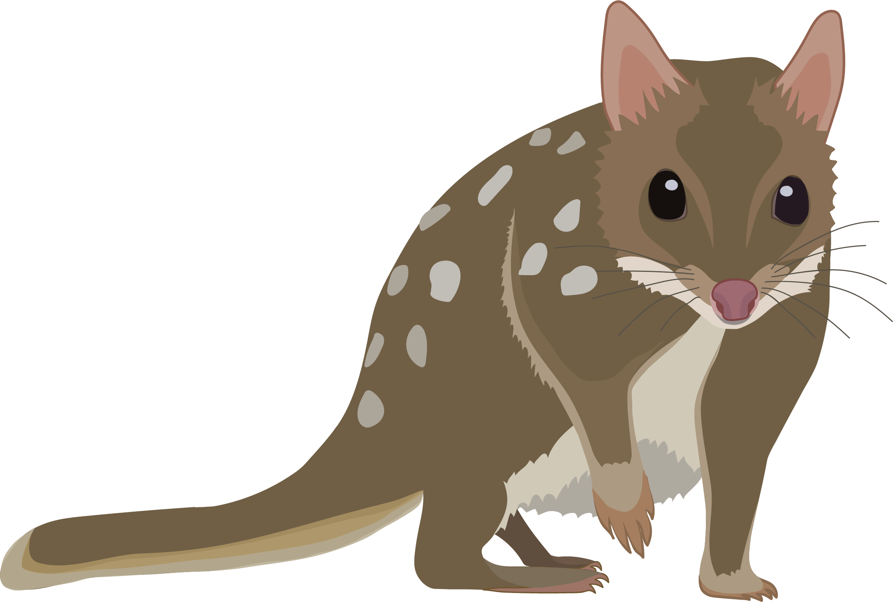

     

<b><i>Dasyurus hallucatus</i></b>

# Step 1: SNP Filtering

This section contains data/code required for carrying out SNP filtering, which is step 1 in the analysis pipeline for this study. Files include: the full R code (*DArTSNPFilt.R*), detailed tutorial (*DArTSNPFilt.pdf*), data (folder: *Data*), and outputs (folder: *Filtering_outputs*) for DArTSeq (https://www.diversityarrays.com/) SNP visualisation and filtering. We step through the process of filtering DArTSeq SNPs (also relevant to any reduced representation SNP data) using the following files in the *Data* folder as the starting input:  

### Data supplied by DArT:
* 1-row SNP csv (*Report_DDasy19-4717_1Row_NameEdit.csv*)  
* 2-row SNP csv (*Report_DDasy19-4717_2Row_NameEdit.csv*)  
* Read count csv (*ReadCounts_DDasy19-4717_NameEdit.csv*)  

### Study specific data:  
* Sample meta-data csv (including ID, pop, lon/lat, other info; *Dasyurus_hallucatus_ind.metadata.csv*)  
* Shape file of study region (*PilbaraIBRA.shp*)  
* Tasmanian devil chromosome info (*TasDevil7.1_Scaffold_Info.csv*)  

Individual plots and the filtered data are saved in the *Filtering_outputs* folder.

# Step 2: Sample Cleaning

Following SNP filtering, we carried out step 2 of the analysis pipeline (sample cleaning), by removing duplicated samples (i.e. samples accidentally sequenced twice due to a labeling issue), and highly related individuals. We calculate Wang's (2002) pairwise relatedness estimate and remove one individual from the pair if relatedness is greater >=0.25 to avoid biasing population genetic analyses. Finally, we also generate sample buffers of different distances (0 - 20km) to group samples in similar locations for later use.

The full annoted R code (*SampleCleaning.R*) is provided, which uses the original sample meta-data file (*Data/Dasyurus_hallucatus_ind.metadata.csv*) and the genlight (*Filtering_outputs/gl.Dhal_FinalFilt.rdata*) generated in the step 1 (SNP filtering) as inputs.

&nbsp;

 This work is licensed under a <a rel="license" href="http://creativecommons.org/licenses/by/4.0/">Creative Commons Attribution 4.0 International License</a>.

